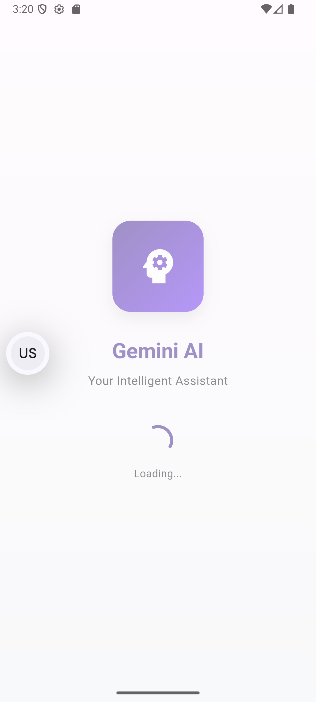

# Gemini AI Demo

A minimal, modern Flutter app UI for a Gemini AI integration demo. This app showcases a clean, Material 3 design with soft pastel colors and Google's modern style.

## Features

- **Splash Screen**: Clean onboarding with Gemini logo and app name
- **Chat Interface**: Modern chat screen with user and AI message bubbles
- **Material 3 Design**: Uses the latest Material Design 3 system
- **Responsive Design**: Works on both Android and iOS
- **Modern UI**: Soft pastel colors, rounded corners, and smooth animations

## Screens

### 1. Splash Screen
- Animated Gemini logo with gradient background
- App title and subtitle
- Loading indicator
- Smooth fade-in and scale animations

### 2. Chat Screen
- Top app bar with "Gemini AI" title
- Scrollable chat area displaying user and AI messages
- Rounded text input box with send button
- Message bubbles with different styles for user and AI
- Typing indicators
- Clear chat functionality

## Architecture

The app follows Clean Architecture principles with the following structure:

```
lib/
## Project Structure
├── core/
│   ├── constants/
│   │   ├── app_colors.dart      # Color scheme and gradients
│   │   ├── app_strings.dart     # Text constants
│   │   └── app_styles.dart      # Typography and spacing
│   └── routes/

│       ├── app_router.dart      # Navigation logic
│       └── app_routes.dart      # Route constants
├── features/
│   ├── chat/
│   │   ├── data/
│   │   │   ├── models/
│   │   │   └── repositories/
│   │   ├── domain/
│   │   │   ├── entities/
│   │   │   ├── repositories/
│   │   │   └── usecases/
│   │   └── presentation/
│   │       ├── controllers/
│   │       └── views/
│   └── splash/
│       └── presentation/
│           └── views/
├── theme/
│   ├── app_theme.dart           # Material 3 theme configuration
│   └── theme_provider.dart      # Theme state management
├── widgets/
│   └── custom_loader.dart       # Reusable loading widget
└── main.dart                    # App entry point
```
## Screenshots

Here are the screenshots showcasing the app's UI and features:
<p >
  
  
</p>

## Design System

### Colors
- **Primary**: Purple gradient (#6750A4 to #8B5CF6)
- **Surface**: Clean white/light gray backgrounds
- **User Messages**: Purple background with white text
- **AI Messages**: Light gray background with dark text

### Typography
- Uses system fonts with consistent sizing
- Clear hierarchy with display, headline, title, body, and label styles
- Proper line heights and letter spacing

### Spacing
- Consistent spacing system (4px, 8px, 12px, 16px, 20px, 24px, 32px, etc.)
- Proper padding and margins throughout the app

### Components
- Rounded corners (12px, 16px, 24px radius)
- Subtle shadows for depth
- Smooth animations and transitions

## Getting Started

### Prerequisites
- Flutter SDK (3.8.0 or higher)
- Dart SDK
- Android Studio / VS Code

### Installation

1. Clone the repository:
```bash
git clone <repository-url>
cd gemini_ai_demo
```

2. Install dependencies:
```bash
flutter pub get
```

3. Run the app:
```bash
flutter run
```

## Dependencies

- **flutter**: Core Flutter framework
- **cupertino_icons**: iOS-style icons
- **http**: HTTP client for API calls (for future AI integration)

## Current Implementation

The app currently uses a mock AI implementation that simulates responses. The chat functionality is fully working with:

- Real-time message sending and receiving
- Typing indicators
- Message bubbles with proper styling
- Error handling
- Chat history management (in-memory)

## Contributing

1. Fork the repository
2. Create a feature branch
3. Make your changes
4. Add tests if applicable
5. Submit a pull request

## License

This project is licensed under the MIT License - see the LICENSE file for details.

## Acknowledgments

- Google Material Design 3 guidelines
- Flutter team for the amazing framework
- Gemini AI for inspiration
